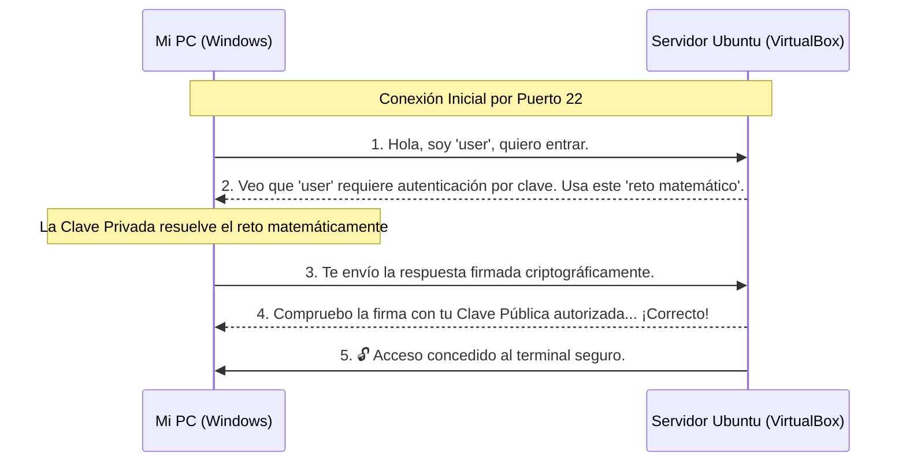

# 🛡️ SSH Remote Server Setup: Dominando las Conexiones Seguras


¡Bienvenido a mi proyecto **SSH Remote Server Setup**! Este reto de nivel **básico** me ha servido para asentar unas bases de seguridad imprescindibles en cualquier entorno Linux moderno.

## 🎯 Objetivo del Proyecto

El objetivo principal de este proyecto ha sido montar un servidor Linux desde cero y configurarlo para permitir conexiones remotas seguras mediante **SSH**. 

He dejado atrás las típicas (y vulnerables) contraseñas para pasar a utilizar un sistema de **autenticación por claves criptográficas**. Esto no solo hace que mis conexiones sean mucho más seguras contra ataques de fuerza bruta, sino que también es mucho más cómodo a la hora de automatizar tareas.

## 🧠 Entendiendo SSH (Secure Shell) a fondo

> [!NOTE]
> **¿Qué es exactamente SSH?**
> SSH es un protocolo de red que permite operar servicios de red de forma segura sobre una red no segura. Básicamente, crea un "túnel encriptado" entre tu ordenador y el servidor. Nadie que intercepte el tráfico de red podrá leer lo que estás enviando o recibiendo.

### La magia de la Criptografía Asimétrica 🪄

SSH utiliza un sistema de dos llaves (par de claves) para funcionar:

| Tipo de Clave | ¿Qué hace? | Regla de oro |
| :--- | :--- | :--- |
| 🔓 **Clave Pública** (`.pub`) | Es como un candado que tú repartes. Encripta los mensajes para que solo tu clave privada pueda abrirlos. | Se puede (y debe) compartir con los servidores a los que quieres entrar. |
| 🔑 **Clave Privada** | Es la única llave maestra capaz de abrir ese candado y firmar tu identidad digital. | **NUNCA** sale de tu ordenador personal. Es tu identidad secreta. |

## 🏗️ Arquitectura de Conexión

Aquí muestro de forma visual cómo se comunican mis máquinas. En lugar de alquilar un servidor en la nube (como AWS o DigitalOcean), he optado por montar mi propio "laboratorio local" utilizando VirtualBox.



## 📋 Resumen de mi Entorno

| Atributo | Valor |
| :--- | :--- |
| **Sistema Operativo** | Ubuntu Server 24.04 |
| **IP del Servidor** | `192.168.1.134` *(Modo Adaptador Puente)* |
| **Usuario** | `user` |
| **Tipo de Claves** | RSA (4096 bits) |

---

## 🚀 Guía Paso a Paso: Cómo lo hice

### 1. Preparación del Servidor Linux
Primero, instalé una máquina virtual con Ubuntu Server. Lo más importante durante la instalación fue habilitar el servicio **OpenSSH Server** para asegurar que el puerto 22 estuviera escuchando.
Para descubrir la IP que mi router le había asignado a mi servidor, ejecuté desde dentro de la máquina:
```bash
ip a
```

### 2. Creación de las Claves SSH (en mi PC)
Para cumplir con los requisitos del reto, generé **dos pares de claves** SSH desde mi máquina principal (Windows) usando una encriptación robusta de 4096 bits. 

> [!TIP]
> Al generar las claves, decidí dejar la `passphrase` (contraseña de la clave) en blanco para permitir que mis futuros scripts puedan iniciar sesión sin pedirme confirmación cada vez.

```bash
# Generación de la primera clave
ssh-keygen -t rsa -b 4096 -f $HOME/.ssh/id_rsa_1

# Generación de la segunda clave
ssh-keygen -t rsa -b 4096 -f $HOME/.ssh/id_rsa_2
```
Esto me creó los archivos públicos (`.pub`, los que puedo compartir) y los privados (¡los que nunca debo pasarle a nadie!).

### 3. Autorización de las Claves en el Servidor (`ssh-copy-id`)

> [!IMPORTANT]
> **¿Por qué hacemos esto?**
> El servidor necesita conocer tu "candado" (clave pública) para poder reconocerte. Si el servidor no tiene tu clave pública anotada en su lista de invitados VIP (el archivo `authorized_keys`), no te dejará pasar, sin importar que tengas la clave privada correcta.

Para que el servidor confíe en mí, tuve que inyectar mis claves públicas dentro del archivo mágico `$HOME/.ssh/authorized_keys` del servidor. Para esto, usé mi contraseña manual por última vez:

```bash
# Copiar la primera clave pública al servidor
ssh-copy-id -i $HOME/.ssh/id_rsa_1.pub user@192.168.1.134

# Copiar la segunda clave pública al servidor
ssh-copy-id -i $HOME/.ssh/id_rsa_2.pub user@192.168.1.134
```

### 4. Prueba de Conexión (El Momento de la Verdad)
Para verificar que el servidor aceptaba ambas claves, inicié sesión especificando la ruta de mi clave privada con el parámetro `-i`:

```bash
# Entrando con la Clave 1
ssh -i $HOME/.ssh/id_rsa_1 user@192.168.1.134

# Entrando con la Clave 2
ssh -i $HOME/.ssh/id_rsa_2 user@192.168.1.134
```

> [!TIP]
> **El comando estándar por excelencia**
> Aunque arriba he sido específico indicando qué clave usar con `-i`, es importante saber que el comando universal de toda la vida para conectarse a cualquier servidor Linux (ya sea con contraseña o con claves por defecto) es mucho más simple:
> ```bash
> ssh user@192.168.1.134
> ```

¡Boom! Acceso directo al servidor sin necesidad de teclear ninguna contraseña. 🎉

---

## ⚙️ El Toque Mágico: Configurando mi Alias SSH

Tener que escribir la IP y la ruta de la clave cada vez que me conecto es un poco rollo y propenso a errores tipográficos. Para solucionarlo, configuré un "acceso directo" editando el archivo `config` de mi cliente SSH:

```bash
nano $HOME/.ssh/config
```

Y le añadí este bloque:
```text
Host mi-mv-ubuntu
    HostName 192.168.1.134
    User user
    IdentityFile $HOME/.ssh/id_rsa_1
```

**El Resultado:** 
Ahora, desde cualquier terminal de mi ordenador, solo tengo que escribir esto para entrar instantáneamente a mi servidor:
```bash
ssh mi-mv-ubuntu
```

## 🔗 Enlaces
- [Reto original en roadmap.sh](https://roadmap.sh/projects/ssh-remote-server-setup)
