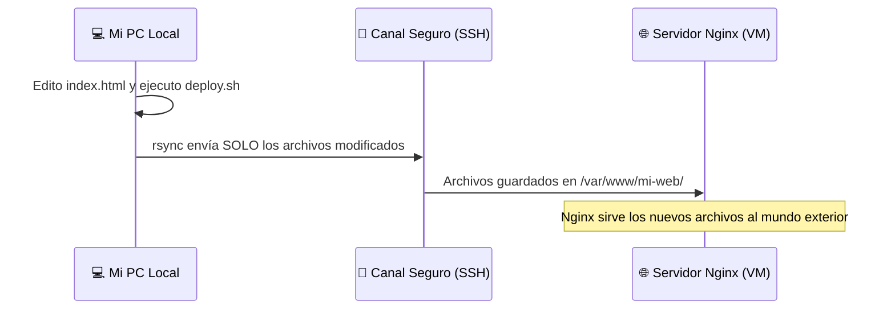

# 🌍 Static Site Server: Nginx & Rsync


¡Bienvenido a mi proyecto **Static Site Server**! Este es el cuarto proyecto de nivel **básico**, donde he puesto en práctica mis conocimientos montando un servidor web real desde cero.

## 🎯 Objetivo del Proyecto

El objetivo de este reto ha sido comprender cómo funciona la web "por debajo". En lugar de usar servicios modernos donde haces un clic y todo se publica automáticamente, aquí he construido yo mismo la infraestructura:
1. Instalando y configurando **Nginx** como servidor web en mi máquina virtual.
2. Utilizando la herramienta **`rsync`** para crear un script de despliegue automatizado. Este script transporta los archivos de mi PC al servidor de manera hiper-eficiente utilizando el canal seguro SSH que configuré en el reto anterior.

## 🏗️ Arquitectura del Despliegue

Así es como funciona mi flujo de trabajo cuando quiero publicar un cambio en la web:



---

## 🚀 Guía Paso a Paso: Cómo lo he montado

A continuación, documento los pasos exactos que seguí para completar este reto. Si quieres replicarlo en tu entorno, sigue este orden.

### Parte 1: Configurar el Servidor (Máquina Virtual)

1. **Entrar al servidor de forma segura:**
   Utilizando el alias que creé en el reto anterior, entré por SSH a mi máquina Ubuntu sin necesidad de poner contraseñas:
   ```bash
   ssh mi-mv-ubuntu
   ```

2. **Instalar el servidor web Nginx:**
   ```bash
   sudo apt update
   sudo apt install nginx -y
   ```

3. **Crear la carpeta para alojar mi web:**
   Por convención, las webs se guardan en el directorio `/var/www/`. Creé una carpeta específica para este proyecto:
   ```bash
   sudo mkdir -p /var/www/mi-web
   ```

4. **Arreglar los permisos (¡Paso Crítico!):**
   Por defecto, esa carpeta le pertenece al administrador `root`. Como voy a usar `rsync` para enviar archivos con mi usuario normal, tuve que darle la propiedad de la carpeta a mi usuario para no tener errores de "Permiso denegado":
   ```bash
   sudo chown -R $USER:$USER /var/www/mi-web
   ```

5. **Configurar Nginx para que apunte a mi carpeta:**
   Edité el archivo de configuración por defecto de Nginx:
   ```bash
   sudo nano /etc/nginx/sites-available/default
   ```
   Dentro del archivo, busqué la línea que decía `root /var/www/html;` y la cambié por mi nueva ruta: `root /var/www/mi-web;`.
   
   Finalmente, reinicié Nginx para aplicar los cambios:
   ```bash
   sudo systemctl restart nginx
   ```

### Parte 2: El Script de Despliegue en mi PC (Local)

En la carpeta de este proyecto (`Basico/static-site-server/`) he creado dos cosas:
1. Una subcarpeta llamada `public/` que contiene el diseño de mi web (`index.html` y `style.css`).
2. El script mágico `deploy.sh`.

#### ¿Qué hace el script de despliegue?
En lugar de subir los archivos a mano cada vez que cambio una coma en el código, el script usa el comando `rsync`:
```bash
rsync -avz --delete ./public/ mi-mv-ubuntu:/var/www/mi-web
```
- `-a`: Modo archivo (preserva fechas y permisos intactos).
- `-v`: Verbose (me va chivando por pantalla qué archivos se están copiando exactamente).
- `-z`: Comprime los datos temporalmente para que viajen rapidísimo.
- `--delete`: Si borro una imagen antigua en mi PC, `rsync` la borrará también del servidor para que ambos sitios sean un espejo perfecto.

## 🛠️ Cómo ejecutar y probar este proyecto

1. Antes de nada, dale permisos de ejecución al script en tu PC:
   ```bash
   chmod +x deploy.sh
   ```
2. Lanza el despliegue. Verás cómo los archivos suben volando al servidor:
   ```bash
   ./deploy.sh
   ```
3. Abre tu navegador web favorito y entra en la IP de tu servidor (ej: `http://192.168.1.134`). ¡Verás la página que acabas de publicar!

## 🔗 Enlaces
- [Reto original propuesto por roadmap.sh](https://roadmap.sh/projects/static-site-server)
