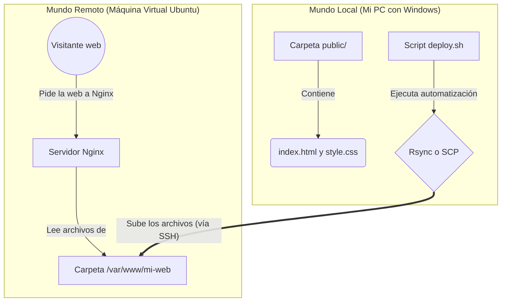

# 🌍 Static Site Server: Nginx, Rsync & SCP


¡Bienvenido a mi proyecto **Static Site Server**! Este es el cuarto proyecto de nivel **básico**. Aquí he dado un gran salto: he convertido un servidor vacío en un servidor web real capaz de alojar páginas en internet.

## 🎯 ¿Qué he aprendido en este proyecto?

En lugar de usar plataformas automáticas como Vercel o Netlify donde subes tu código y mágicamente funciona, aquí he montado la infraestructura "a mano". He aprendido dos conceptos vitales en DevOps:

| Concepto | Herramienta Usada | Explicación |
| :--- | :--- | :--- |
| **Servidor Web** | `Nginx` | Es el programa que "escucha" cuando alguien pone mi IP en el navegador y le sirve los archivos HTML y CSS. Funciona como el recepcionista de un hotel. |
| **Sincronización** | `Rsync` / `SCP` | Son herramientas para enviar mis archivos desde mi PC al servidor de forma segura (por SSH). `rsync` es súper inteligente y solo envía lo que ha cambiado, mientras que `scp` copia todo de forma bruta. |

---

## 🏗️ Arquitectura: ¿Cómo funciona mi web?

Para entender el proyecto, hay que tener claro que existen **dos mundos** que se comunican entre sí: el PC local y el servidor remoto.



---

## 🚀 Guía Paso a Paso

Dividiremos la explicación en dos grandes bloques: lo que ocurre en el servidor y lo que ocurre en mi ordenador.

### PARTE 1: Preparando el Servidor (Ubuntu)

Estos pasos se ejecutan **dentro de la máquina virtual**, a la que accedo usando SSH (`ssh mi-mv-ubuntu`).

1. **Instalar el servidor web Nginx:**
   ```bash
   sudo apt update
   sudo apt install nginx -y
   ```
2. **Crear la "habitación" para mi web:**
   Linux guarda las webs en `/var/www/`. Creé una carpeta exclusiva para mi proyecto:
   ```bash
   sudo mkdir -p /var/www/mi-web
   ```
3. **Dar permisos a mi usuario (Vital):**
   > [!WARNING]  
   > Por defecto, la carpeta creada pertenece a `root` (el administrador del sistema). Si intento enviar archivos desde mi PC con mi usuario normal, Linux me bloqueará. Necesito hacerme dueño de esa carpeta para no tener errores de *Permiso Denegado*:
   ```bash
   sudo chown -R $USER:$USER /var/www/mi-web
   ```
4. **Enchufar Nginx a mi carpeta:**
   Edito la configuración base de Nginx:
   ```bash
   sudo nano /etc/nginx/sites-available/default
   ```
   Cambio la ruta de la web por defecto para que mire a mi nueva carpeta:
   - De: `root /var/www/html;`
   - A: `root /var/www/mi-web;`
   
   Y reinicio Nginx para que lea los cambios: 
   ```bash
   sudo systemctl restart nginx
   ```

---

### PARTE 2: El Despliegue Automático (Mi PC)

Aquí es donde entra la automatización DevOps. He creado un script llamado `deploy.sh` en mi ordenador para no tener que subir los archivos manualmente uno a uno.

> [!NOTE]  
> **El problema de Windows vs Linux**
> En un entorno profesional (Linux/Mac), usaríamos el comando `rsync` para subir la web porque es hiper-rápido (solo sube los archivos que han cambiado). Sin embargo, **Windows no incluye `rsync` de serie**. 
> 
> Por tanto, he programado mi script para que sea inteligente: si estoy en Linux usa `rsync`, y si detecta que estoy en Windows, usa el "Plan B" y despliega la web con `scp` (Secure Copy), que hace un trabajo parecido y **sí** viene en Windows.

#### Así funciona el código de mi script:

```bash
# 1. Comprueba si rsync existe (Linux/Mac)
if command -v rsync >/dev/null 2>&1; then
    # MODO LINUX: Sincronización inteligente
    # -a (archivos), -v (verboso), -z (comprimido), --delete (borra lo antiguo)
    rsync -avz --delete ./public/ mi-mv-ubuntu:/var/www/mi-web

else
    # MODO WINDOWS: Copia de seguridad
    # scp (Secure Copy) envía todos los archivos de golpe por SSH
    scp -r ./public/* mi-mv-ubuntu:/var/www/mi-web
fi
```

### 🛠️ ¿Cómo probarlo la primera vez?

1. Abre una terminal en tu PC (si estás en Windows, abre Git Bash o PowerShell).
2. Dale permisos de ejecución al script:
   ```bash
   chmod +x deploy.sh
   ```
3. Ejecútalo. Verás cómo automáticamente detecta tu sistema operativo y envía los archivos:
   ```bash
   ./deploy.sh
   ```
4. Abre tu navegador de internet (Chrome, Firefox...) y pon la IP de tu servidor (por ejemplo: `http://192.168.1.134`). ¡Verás la página que acabas de publicar!

### 🔄 El Día a Día (Si vuelves otro día)

Una vez que has hecho la configuración inicial, Nginx se queda encendido **para siempre** en tu servidor (incluso si lo reinicias). Por tanto, tu flujo de trabajo a partir de ahora es súper cómodo:

1. **Asegúrate de que la Máquina Virtual está encendida** (porque ahí vive tu servidor Nginx). No hace falta que entres dentro por SSH, basta con que VirtualBox esté corriendo.
2. Abre cualquier editor en tu PC (VSCode, por ejemplo) y **modifica tu web** (cambia un texto en `index.html` y guarda el archivo).
3. Abre una terminal en tu Windows en la ruta donde está el script `deploy.sh` y ejecútalo de nuevo:
   ```bash
   ./deploy.sh
   ```
4. Ve a tu navegador web, entra en la IP de tu máquina (por ejemplo `http://192.168.1.134`), y **pulsa F5 para actualizar**. ¡Verás tus cambios subidos al instante!

---

## 🔗 Enlaces
- [Reto original propuesto por roadmap.sh](https://roadmap.sh/projects/static-site-server)
